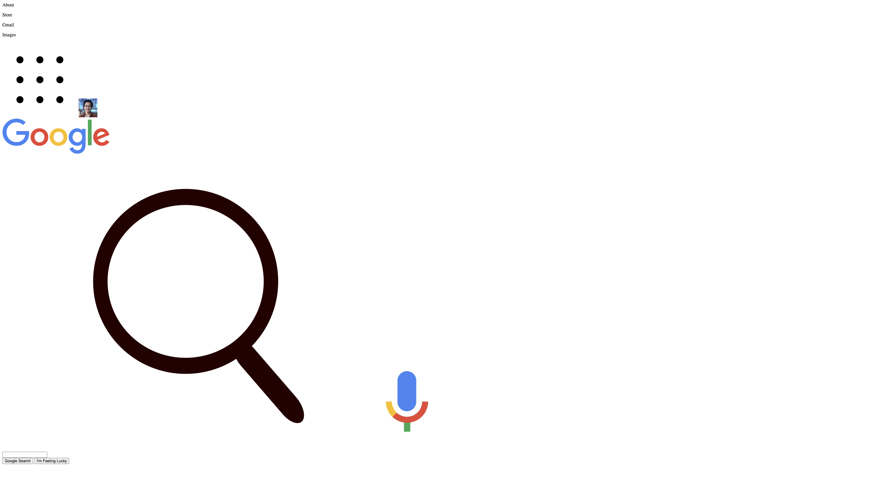
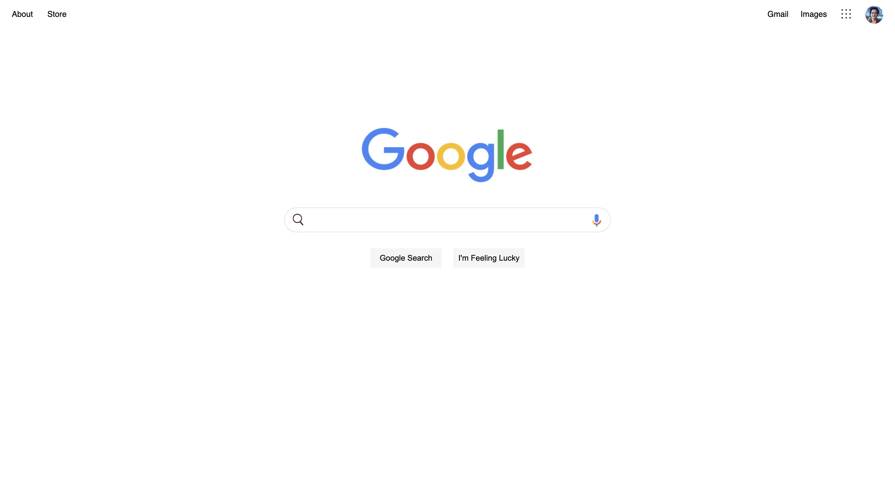

# Google-Homepage-Takehome

## Instructions ## 

Your goal for this takehome assignment is to create a replica of the Google Homepage using basic html and css (don't worry, it doesn't actually have to funciton at 
all, you just want to create a webpage that looks similar!) 

We have provided you with the necessary image files and the html shell code. If you try loading our index.html shell code, you will get a very ugly looking Google homepage. Your goal is to use css to style the homepage to look as close to the Google Homepage as possible (just use the default google.com website with no chrome themes or add-ons). **The person who is able to get closest to the actual homepage will get a prize!** A lot of the css that you might need will not have been covered during our workshop, so make sure you refer to online resources if you need help styling things. For example, a quick Google search will tell you how to center images on the screen, how to underline text, how to change the color of different things, etc. 

You will also see in the html shell code we've provided that we refer to an image called "images/headshot.jpeg" For this, upload your own profile picture to the image folder inside the directory we gave you. If the profile picture name is something other than "headshot.jpeg", make sure to update the html code accordingly. 

Feel free to modify the index.html file we provided you if you want. 

## Before Styling ## 

## After Styling ## 

